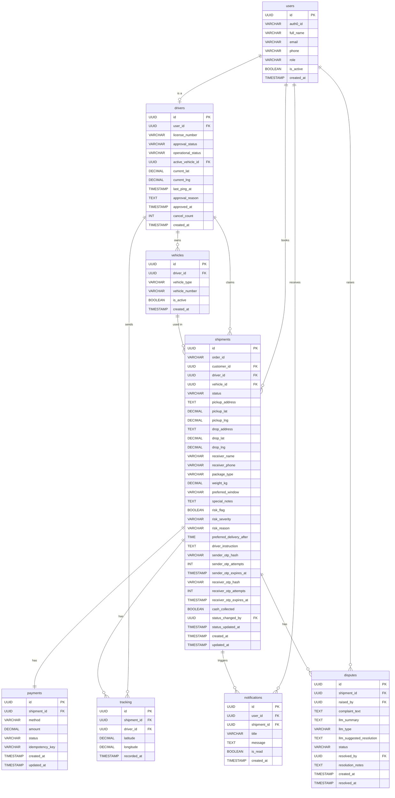

# Logistics & Shipment Tracking System — ER Diagram

---

## Tables Summary

| Table | Type | LLM Columns |
|---|---|---|
| users | Master | None |
| drivers | Master | None |
| vehicles | Master | None |
| shipments | Master | risk_flag, risk_severity, risk_reason, preferred_delivery_after, driver_instruction |
| tracking | Transactional | None |
| payments | Transactional | None |
| notifications | Transactional | None |
| disputes | Transactional | llm_summary, llm_type, llm_suggested_resolution |

## Enums

| Column | Table | Values |
|---|---|---|
| role | users | CUSTOMER, DRIVER, ADMIN |
| approval_status | drivers | PENDING, APPROVED, REJECTED, SUSPENDED |
| operational_status | drivers | ONLINE, OFFLINE, ON_DELIVERY |
| vehicle_type | vehicles | TWO_WHEELER, THREE_WHEELER, FOUR_WHEELER, HEAVY_VEHICLE |
| status | shipments | PENDING_PAYMENT, OPEN, ASSIGNED, IN_TRANSIT, DELIVERED, CANCELLED, PICKUP_FAILED, STALE |
| package_type | shipments | DOCUMENT, SMALL_PARCEL, LARGE_PARCEL, FRAGILE, HOUSEHOLD |
| preferred_window | shipments | MORNING, AFTERNOON, EVENING |
| risk_severity | shipments | HIGH, LOW, NONE |
| method | payments | COD, ONLINE |
| status | payments | PENDING, SUCCESS, FAILED, REFUNDED |
| llm_type | disputes | WRONG_ADDRESS, LATE_DELIVERY, DAMAGED_PACKAGE, DRIVER_BEHAVIOUR |
| status | disputes | OPEN, RESOLVED, ESCALATED |

