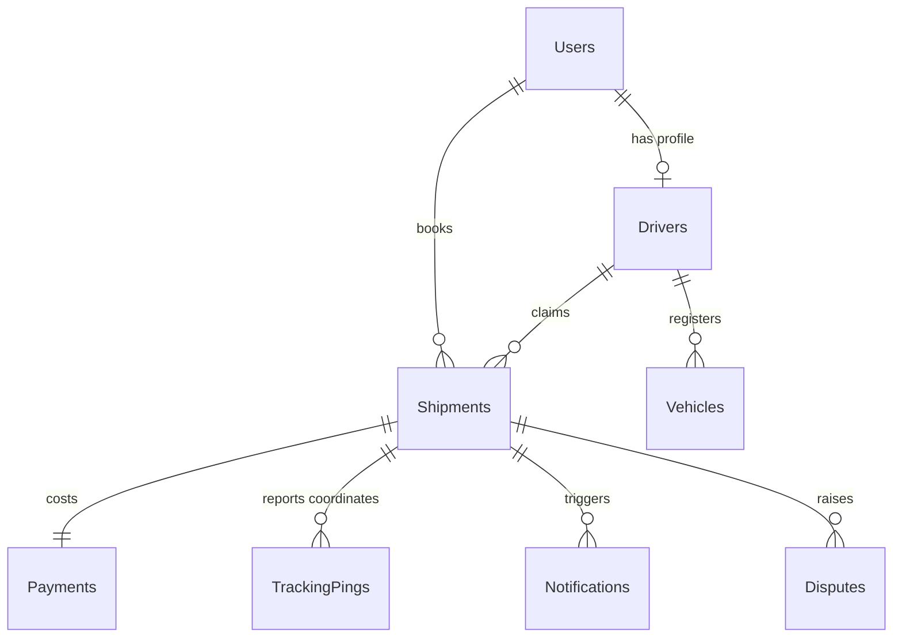
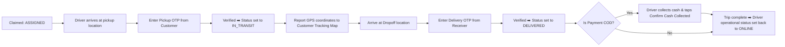

# CargoZ - Enterprise AI-Driven Logistics & Real-Time Tracking System

CargoZ is a modern, high-performance, real-time logistics and shipment tracking platform powered by C# .NET 10, Angular 19 (Signals + OnPush), a Python FastAPI AI Agent, and Azure Cloud Infrastructure.

---

## 🌟 Key Features

- **Real-Time Signal-Driven Tracking**: Instant status updates and Leaflet GPS coordinate streaming using SignalR WebSockets and reactive Angular Signals without HTTP polling.
- **AI Driver Verification Agent**: Asynchronous document OCR extraction, government registry lookup simulation, and administrative override fallbacks using LLM agents.
- **Pessimistic Concurrency Locking**: Database transaction locks (`GetByIdForUpdateAsync`) defending shipment claims against millisecond race conditions.
- **Role-Based Authorization & Security**: Auth0 OAuth2 JWT validation with custom C# `ClaimsTransformation` dynamically injecting driver and role claims into user principals.
- **Flexible Payment Options**: Support for Cash On Delivery (COD) cash verification flows and Razorpay online checkout integrations with verified webhook signatures.
- **Dispute Resolution Engine**: Dedicated dispute management system for customer complaints with AI resolution suggestions.
- **Enterprise Azure Cloud Architecture**: Azure Key Vault secret management, System-Assigned Managed Identities, and automated GitHub Actions CI/CD pipelines.

---

## 🛠️ Technology Stack

| Layer | Technology |
| :--- | :--- |
| **Backend API** | C# .NET 10 Web API, Entity Framework Core, Serilog |
| **Frontend Web App** | Angular 19, Reactive Signals, Leaflet Maps, Vanilla CSS (Cargo Dark Theme) |
| **AI Verification Agent** | Python 3.11, Flask, Anthropic Claude API |
| **Database** | PostgreSQL (Production) / SQLite (Local) |
| **Real-Time Push** | ASP.NET Core SignalR WebSockets |
| **Authentication** | Auth0 OAuth2 JWT Bearer Security |
| **Cloud & Infrastructure** | Azure App Service, Azure Key Vault, Managed Identity, Azure Static Web Apps |
| **CI/CD Automation** | GitHub Actions Workflows |

---

## 📐 System Architecture & Entity-Relationship Schema



---

## 🔄 Delivery Lifecycle Flow



---

## 🔐 Security & Concurrency Protections

1. **Pessimistic Claims Locking**:
   To prevent two drivers from claiming the same shipment at the exact same millisecond, the backend executes `GetByIdForUpdateAsync` inside a serializable database transaction. The first driver locks and updates the record, while competing requests receive an instant `409 Conflict` error.
2. **Auth0 Claims Transformation**:
   Incoming Auth0 JWT tokens are augmented at runtime by C# `ClaimsTransformation`, querying the database to append user roles and driver profile IDs to the request principal.
3. **Azure Key Vault & Managed Identity**:
   Zero secrets (LLM keys, Razorpay secrets, database strings) are stored in App Settings or environment files in production. App Services authenticate with Azure Key Vault via System-Assigned Managed Identity (`DefaultAzureCredential`).

---

## 🚀 Local Development Setup Guide

### 1. Prerequisites
- [.NET 10 SDK](https://dotnet.microsoft.com/)
- [Node.js (v18+) & Angular CLI](https://angular.io/)
- [Python 3.11+](https://www.python.org/)

### 2. Running the C# Backend
```bash
cd backend
dotnet restore
dotnet run
# API running at http://localhost:5286
```

### 3. Running the Python AI Agent
```bash
cd backend-agent
python -m venv venv
# Windows: venv\Scripts\activate | Linux/macOS: source venv/bin/activate
pip install -r requirements.txt
python main.py
# Agent service running at http://localhost:8000
```

### 4. Running the Angular Frontend
```bash
cd frontend
npm install
ng serve
# Web app running at http://localhost:4200
```

---

## ☁️ Azure Production Deployment & GitHub Actions

### GitHub Actions Pipelines (`.github/workflows/`)
- `backend-ci-cd.yml`: Builds C# backend, runs `dotnet test`, applies EF Core migrations, and deploys to `logistics-api-shethu`.
- `agent-ci-cd.yml`: Installs Python dependencies, tests agent endpoints, and deploys to `logistics-agent-shethu`.
- `frontend-ci-cd.yml`: Injects production environment values, executes `ng build --configuration production`, and deploys to Azure Static Web Apps.
